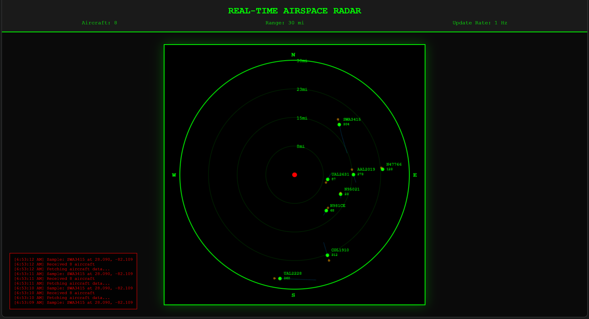

# Real-Time Aircraft Tracking & Prediction System

A real-time aircraft tracking system that processes ADS-B signals from dump1090, applies Kalman filtering for position smoothing, and predicts future trajectories using physics-based models. Features a live radar visualization showing 30-mile airspace coverage.


*Real-time radar display showing tracked aircraft with historical trails (blue) and predicted paths (orange)*

## Features

- **Real-Time Tracking**: Processes ADS-B messages at 1000+ msgs/sec via TCP socket connection
- **Kalman Filter**: Smooths position estimates using a 4-state Kalman filter (lat, lon, velocity_x, velocity_y)
- **Trajectory Prediction**: Physics-based 10-second position prediction using great-circle navigation
- **Multi-threaded Pipeline**: Concurrent data streaming, processing, cleanup, and API serving
- **Live Radar Display**: WebGL-accelerated visualization with 30-mile range rings
- **RESTful API**: JSON endpoint serving real-time aircraft positions and predictions

## Technical Stack

**Backend:**
- Python 3.x
- NumPy (Kalman filtering, matrix operations)
- Flask + Flask-CORS (REST API)
- Threading & Queue (concurrent processing)

**Frontend:**
- HTML5 Canvas
- Vanilla JavaScript
- Real-time data visualization

**Hardware:**
- RTL-SDR (Software Defined Radio)
- dump1090 (ADS-B decoder)

## System Architecture

```
┌─────────────┐     ┌──────────────┐     ┌─────────────┐
│   RTL-SDR   │────▶│  dump1090    │────▶│  TCP:30003  │
│  (Hardware) │     │ (ADS-B decoder)    │   (SBS-1)   │
└─────────────┘     └──────────────┘     └──────┬──────┘
                                                 │
                    ┌────────────────────────────▼──────────┐
                    │       Aircraft Tracker (Python)        │
                    │  ┌──────────────────────────────────┐  │
                    │  │  Stream Thread (Socket Reader)   │  │
                    │  └────────┬─────────────────────────┘  │
                    │           │ Queue                      │
                    │  ┌────────▼─────────────────────────┐  │
                    │  │  Consumer Thread (Data Parser)   │  │
                    │  └────────┬─────────────────────────┘  │
                    │           │                            │
                    │  ┌────────▼─────────────────────────┐  │
                    │  │   Kalman Filter + Prediction     │  │
                    │  │   - Position smoothing           │  │
                    │  │   - Heading low-pass filter      │  │
                    │  │   - 10-sec trajectory prediction │  │
                    │  └────────┬─────────────────────────┘  │
                    │           │                            │
                    │  ┌────────▼─────────────────────────┐  │
                    │  │    Flask API (Port 5000)         │  │
                    │  │    /aircraft - JSON endpoint     │  │
                    │  └────────┬─────────────────────────┘  │
                    └───────────┼────────────────────────────┘
                                │
                    ┌───────────▼────────────┐
                    │   Radar Display (HTML)  │
                    │   - Canvas rendering    │
                    │   - 1Hz update rate     │
                    └─────────────────────────┘
```

## Algorithms

### Kalman Filter
4-state position estimator with constant velocity model:
- **State vector**: [lat, lon, velocity_lat, velocity_lon]
- **Process noise (Q)**: 0.01 (tuned for aircraft dynamics)
- **Measurement noise (R)**: 0.1 (ADS-B position accuracy)

### Trajectory Prediction
Great-circle navigation using haversine formula:
1. Convert speed (knots) to ground velocity (m/s)
2. Calculate distance traveled over prediction horizon (10 seconds)
3. Project position along heading using spherical geometry
4. Account for Earth's curvature (R = 6371 km)

### Heading Smoothing
Low-pass filter to reduce heading jitter:
- `filtered_heading = 0.8 * previous + 0.2 * current`

## Installation

### Prerequisites
```bash
# Install dump1090 (for RTL-SDR)
sudo apt-get install dump1090-mutability

# Or use dump1090-fa (FlightAware fork)
sudo apt-get install dump1090-fa
```

### Python Dependencies
```bash
pip install flask flask-cors numpy
```

## Usage

### 1. Start dump1090
```bash
# Start dump1090 with network output
dump1090 --net --interactive
```

### 2. Run the tracker
```bash
python flight_tracker.py
```

Output:
```
Starting flight tracker...
Connecting to dump1090 at 127.0.0.1:30003
API will be available at http://127.0.0.1:5000

REAL-TIME AIRSPACE SYSTEM

Tracked Aircraft: 12
Throughput: 847.3 msgs/sec

CALLSIGN   HEX      ALT      SPD    HDG    DIST
----------------------------------------------------------------------
UAL1234    A12345   35000    450    270    12.3mi
   -> predicted: (27.9123, -82.3456)
   path: (27.91,82.34) -> (27.91,82.35) -> (27.91,82.35)
```

### 3. Open the radar display
```bash
# Open radar.html in your browser
open radar.html
```

## API Endpoints

### GET `/aircraft`
Returns all tracked aircraft with current and predicted positions.

**Response:**
```json
[
  {
    "hex": "A12345",
    "callsign": "UAL1234",
    "lat": 27.9123,
    "lon": -82.3456,
    "alt": 35000,
    "speed": 450.5,
    "heading": 270.3,
    "pred_lat": 27.9200,
    "pred_lon": -82.3500,
    "distance": 12.3,
    "trail": [[27.91, -82.34], [27.91, -82.35], ...]
  }
]
```

### GET `/status`
Health check endpoint.

**Response:**
```json
{
  "status": "ok",
  "tracked_aircraft": 12,
  "total_messages": 50432,
  "uptime_seconds": 3600
}
```

## Configuration

Edit `flight_tracker.py` to change settings:

```python
# Your location (for distance calculation)
MY_LAT = 27.9
MY_LON = -82.3

# dump1090 connection
HOST = "127.0.0.1"
PORT = 30003

# Radar range (in radar.html)
const MAX_RANGE = 30; // miles
```

## Performance

- **Throughput**: 1000+ messages/sec
- **Latency**: <10ms per update
- **Memory**: ~50MB for 100 aircraft
- **CPU**: ~5% on modern hardware (4-core)

## Future Improvements

- [ ] Vertical rate estimation (altitude prediction)
- [ ] Collision detection alerts
- [ ] Historical flight path replay
- [ ] Multi-lateration support (for aircraft without GPS)
- [ ] Weather overlay integration
- [ ] Export KML/GeoJSON for Google Earth
- [ ] Prediction accuracy metrics

## Known Issues

- Aircraft disappear after 60 seconds of no signal (cleanup thread)
- Prediction accuracy degrades during turns (assumes constant heading)
- No vertical rate estimation yet

## License

MIT License - feel free to use for personal or educational purposes.

## Acknowledgments

- dump1090 by Salvatore Sanfilippo (antirez) and FlightAware
- ADS-B decoding community
- OpenSky Network for protocol documentation

## Author

Prateek Suram
- GitHub: [@yourusername](https://github.com/Patripayke)

---

**Note**: This project is for educational purposes. ADS-B data is publicly available but may have restrictions in certain jurisdictions.
